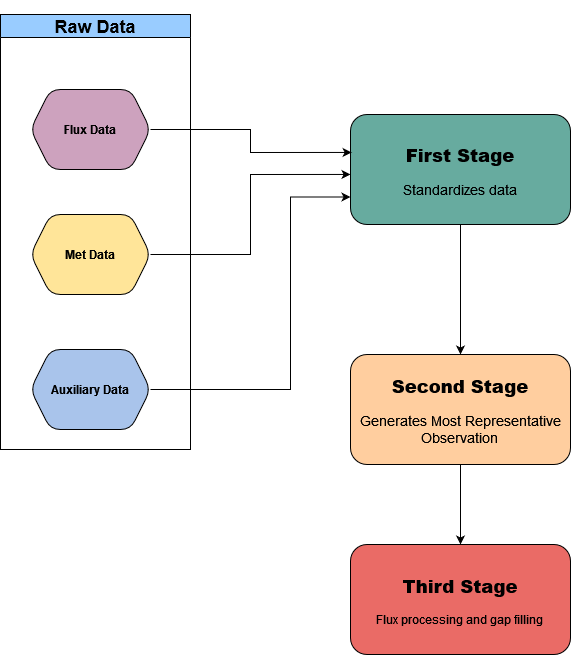

# Instructions and guidelines for Trace Analysis Ini Files

The ini files for a given site dictate how data is transferred from its raw format into a standardized, cleaned and gap-filled format that can be used for scientific analysis. They provide instructions to a set of MATLAB and R scripts used to process our data.  The ini files are necessary because not every site is set up in exactly the same way (different sensors, loggers, record lengths, etc.). The files are separated into three stages:  

* **Stage 1** collects the raw data, applies min/max filtering, assigns consistent variable names, and moves the relevant folders to a "clean" folder in preparation for Stage 2.
  * The data are stored as binary files in "Single-precision floating-point format" (aka Float 32)
  * The clean_tv file, which is located in each raw/clean folder is a standardized 30 minute "time vector" which formats the timestamp of each record in **Local Standard Time**

* **Stage 2** collects the stage 1 data, generates the "best" observation for each trace and moves the relevant folders to a "Clean/SecondStage" folder in preparation for Stage 3.
  * For example if we have two observations for soil temperature at 5 cm, or three soil heat flux plates at 5cm, it will average them to get a more representative value.  It can also gapfill Met data with data from a nearby station
    * i.e. it will pull air temperature data from a nearby environment Canada weather station to fill missing values at a flux site.

* **Stage 3** collects the stage 1 data and applies filtering and gap filling procedures to the flux data.

You can use the **guiPlotTraces** app to view raw or cleaned traces during any stage.  Its helpful to look at the data to make sure things are working as expected.




## First Stage

In the first stage of cleaning the idea is to clean up the data so we can keep only the best measured values (data points) for each sensor. No interpolation is done at this stage so any removed points will not be gap-filled. If the researcher is looking for the best measurements from a particular sensor, this is the data that they want.

The first stage cleaning provides the following features:

1. Selects traces that are needed for future data analysis. Not all the measured variables from a site need to be here - only the ones that will be used in future analysis or that’s needed to improve cleaning.
2. File names from the database can be renamed here. The trace name does not have to be the same as the file name from the database.
3. The original values can be altered (calibrations can be applied, units can be changed).
4. Basic filtering can be done: 
  * Values can be removed if they exceed minMax thresholds. 
  * Values can be clamped to the thresholds if they exceed clampedMinMax values. 
7. This stage creates dependencies between different traces. If one trace gets some points removed here, all its dependent traces will have those points removed too. 

Introduction:
All traces must be enclosed in [Trace] and [End] blocks.
All assignments can be on multiple lines, but should be enclosed in single quotes.
Comments must begin with a percentage sign,%.
The partial path must be included with the inputFileName, when you locate the raw data trace in the database. (Using biomet_path only returns the path: 'year/site/measType/')
Necessary fields are: variableName, inputFileName, measurementType, units, title, and minMax.
All fields must be in Matlab format
All assignments must be to strings in single quotes, or numeric expressions (ex: threshold_const = 6, threshold_const = [6],variableName = 'Some Name')	


Grayed out parameters are legacy properties that should not be used in the new ini files. They can be left in or removed from the old ones.

### Properties

| Field      | Description |
| ----------- | ----------- |
| Header/Comments      | “%” character indicates the beginning of a comment. Program will not process any characters that follow “%”. Use comments to add information and to better document the site. Each line of the ini file can be followed by a comment. Comments were removed from the above example to improve readability of this document. Refer to the example ini file at the end of this document. (link here FirstStage.ini file from DSM site)       |
| Site_name   | Name of the site. Any text can go here.        |
| SiteID      | This is the name attributed to the site in the database (e.g., DSM or BB). |
| Difference_GMT_to_local_time | Time difference between GMT time, that database is kept in, and the standard time at the site location (for PST this is +8). |
|[Trace] | Marks the beginning of a new variable. The section has to end with the keyword <[END]>.|
| variableName | Name of variable for first stage. The variable with this name created here will show up in the sub-folder “Clean” under the same folder where the original database file came from. In the Micromet Lab, these should follow the AmeriFlux naming convention. |
| title | Descriptive title for plots/visualization.|
| originalVariable| This is an example of adding an optional field to a trace that can be used by an advanced user. Here it’s set to be the same as the variableName. Currently, this particular field is not used for generic processing. |
|inputFileName |{‘file name’} - The name of the database file that contains data for this trace. The brackets are mandatory.<br /> The file name can include folder(s): ‘Met/Tair’. The folder paths are relative to the main site path (‘./database/yyyy/siteID’) so the above example translates into this path:   ‘./database/yyyy/siteID/Met/Tair’<br />Over the lifetime of a site, the data logger programs sometimes change and a sensor measurement that was assigned to a variable may change. To allow for different variable names over the site history the inputFileName can be given as: {‘fileName1’,’fileName2’}. In that case the parameter inputFileName_dates also needs to be present in the [Trace]...[END] structure.<br /> Advanced: If there is a need to load up a data file from another site, the path can be constructed in this way: ‘../../siteID2/dataFolder’. The ‘../../’ moves the path pointer up to ‘/database/yyyy’ and from there ‘siteID2/dataFolder’ takes the program to that folder.|
|inputFileName_dates |[ datenum_start1 datenum_end1; datenum_start2 datenum_end2] - starts and ends of data periods for each of the inputFileNames. <br />If there are multiple inputFileNames ( {‘fileName1’, ‘fileName2} ) then the program needs to know the time periods where the data assigned to the variableName should come from ‘fileName1’ and when from ‘fileName2’. In that case, this field is mandatory.<br /> If inputFileName contains only one file name, this parameter is optional. It is still a good practice to use it anyway.<br /> The last ‘datenum_end’ is usually set far into the future: datenum(2999,1,1).|
|measurementType|‘char’ - Mandatory parameter that sets the input and output trace folders. The input folder defaults to: "siteID/measurementType/inputFileName". If relative paths are used they "assume" that the current folder is "siteID/messurementType" so the relative path is referenced to that. The output folder for the cleaned trace is always "siteID/measurementType/clean". <br />Note: If the measurementType is missing (empty) the data will be saved to "siteID/clean/variableName" which is wrong.|
|units|‘char’ - Units for this trace|
|Instrument|Instrument type|
|instrumentSN|Instrument SN. ** check if this parameter can be time-stamped. If not it’s not very useful**|
|calibrationDates|NOT USED|
|loggedCalibration|Used together with currentCalibration. When a trace’s linear calibrations need to be changed, these coefficients are used to convert the trace values from engineering units to its original/raw units. Then the correct calibration coefficients (currentCalibration) are used. This can also be used to change the units. The format is [gain offset startDatenum endDatenum], where startDatenum and endDatenum refer to the time span that this particular set of coefficients was used.<br /> Note: all calibration values need to be in the same line (no line-breaks in the ini file are allowed)!  This can be very inconvenient. Fix it maybe?|
|currentCalibration|Correct(ed) linear calibration coefficients. Used together with loggedCalibrations (see its notes for more details). |
|comments|Any comments.|
|minMax|[min max] - Minimum and maximum thresholds for filtering. The values outside of this range will be set to NaN|
|clamped_minMax|[cMin cMax] Similar to minMax but instead of setting the point outside the range to NaN, it sets their value to the cMin or cMax. (e.g., RH: [0 100]).<br />Note: this property is not mandatory. When used, please make sure that the minMax property boundaries are wider than the boundaries of clamped_minMax because the minMax property is applied first (e.g. RH: minMax = [-1 110], clamped_minMax=[0 100]).|
|zeroPt|In the legacy Biomet database, 0 was used to indicate missing data. The cleaning program would compare every value in the trace and, if it was equal to zero, it would replace it with a NaN. This parameter (zeroPt) was used to change this behavior so that the program looks for a different number. Many programs nowadays use -9999 to indicate bad/missing data points.|
|interpolationType|NOT USED. Indicates which type of interpolation should be used. The default is Matlab’s ‘interp1’. Remove from ini files where feasible.|
|interpLength|NOT USED (same as above)|
|plotBottomRight|plot specifications used for visualization/manual cleaning program (to be implemented) |
|plotBottomLeft |plot specifications used for visualization/manual cleaning program (to be implemented) |
|dependent|Filter dependent variables based on specified trace. It can have multiple dependents that need to be separated by commas: ‘trace1,trace2,trace3’.<br />Note that this needs to be sorted manually. For example, when using the LI-7200 pump, all the traces that depend on the LI-7200 are dependent on the pump trace. So, for the pump: dependent = ‘CO2,H2O’. Then the CO2 trace should have dependent = ‘FC…’ and so on. Avoid circular references: CO2: dependent = ‘FC’, FC: dependent = ‘CO2’.|
|[End]|Marks the end of the trace properties section.|

**Note:**
<br />
Other properties that user wants to use later on in their own programs (or in the “Evaluate” statements in Second and Third stage cleaning ini files) can be added to each of the traces. The function that processes the ini files (read_ini_files.m) will add the property (and its assigned value) to the trace structure but the rest of the Trace Analysis programs will ignore it. The user can then parse the trace info in their own programs (or within “Evaluate” statements) and take advantage of this feature.<br />

## Second Stage
While the first stage cleaning provides the best sensor measurement, the second stage focuses on creating the best measured data for the particular property.  Example would be having multiple sensors measuring air temperature at one height. The second stage would create the best (the highest precision/accuracy, the fewest missing points) data trace (“Tair_best”). At the end of this stage the desired output is the best measured data trace (no gap filling for flux data).

The main features:
1. Combining multiple sensor measurements into one trace. This can be done in different ways or their combinations.<br />
  a. Averaging multiple sensors to remove variability.<br />
  b. Using one sensor as the best (most accurate value) and using the other sensor(s) only to fill in the missing values.<br />
    &ensp; &ensp; i. A relationship can be created between the “best” sensor and its “replacement” and that relationship can be applied to the 
    &ensp; &ensp;&ensp;&ensp;“replacement” values to improve the accuracy.<br />
  c. Using the sensors from another near-by site to fill in the missing values at the current site.<br />
2. More complex user-defined processing can be applied to the trace using the “Evaluate” option. User written Matlab functions can be called from this statement. Multiple Matlab statements can be called from within the “Evaluate” string. Some rules for formatting apply here (see the existing SecondStage ini file for details and examples).


### Properties

| Field      | Description |
| ----------- | ----------- |
| Site_name   | Name of the site. Any text can go here.        |
| SiteID      | This is the name attributed to the site in the database (e.g., DSM or BB). |
| input_path  | This can stay blank |
| output_path | The local output path?  **Example says leave blank?** |
| high_level_path | leave blank:{}. It used to indicate Met/Flux, etc.|
| searchPath  | All traces on this path(s) will be loaded up and available in the SecondStage cleaning. Syntax: use 'auto' or use specific folders to limit or to expand the (example: 'Flux\Clean,Met\Clean,Flags\Clean'). When option 'auto' is used, all the traces created by the FirstStage cleaning will be automatically loaded before the SecondStage cleaning starts. |
|[Trace] | Marks the beginning of a new variable. The section has to end with the keyword <[END]>.|
| variableName | Name of variable for second stage. The variable with this name created here will show up in the yyyy/SiteID/Clean/SecondStage folder In the Micromet Lab, these should follow the AmeriFlux naming convention. |
|inputFileName_dates |[ datenum_start1 datenum_end1; datenum_start2 datenum_end2] - starts and ends of data periods for each of the traces. Some traces do not span the entire project run. If their start and/or end time does not match the project's start/end, one can use this variable the limit their extent.<br />The last ‘datenum_end’ is usually set far into the future: datenum(2999,1,1).|
| Evaluate | User defined function.  If no function is applied, default input will just pass variable thru.  ```Evaluate = 'TKE = TKE;'```.  Use ```calc_avg_trace``` function (see above) to gap-fill met variables (eg. air temp) with values from secondary measurements or nearby sites|
| Title | Descriptive title for plots/visualization. |
| units | ‘char’ - Units for this trace |
| minMax | minMax filter values from stage 1 - ** This parameter is needed due to syntax requrements but it is NOT used for cleaning **  |

## Third Stage

The ThirdStage processing for Micromet group is done using REddyProc library. To make this compatible with the rest of our cleaning process that's done in Matlab (main function: fr_automated_cleaning) an interface between the Matlab and R libraries has been created: runThirdStageCleaningREddyProc.m.

The examples is the text and the R ini-files below should work on DSM site when used on vinimet computer (the data base path being p:\database). Adjust if using these examples on a different computer or for a different site

**Notes:**

* For the manual cleaning to work, the file **DSM_setThirdStageCleaningParameters.R** has to be in **../database/Calculation_procedures/TraceAnalysis_ini/DSM/log/** . For automated cleaning, this file is generated by fr_automated_cleaning function.
  * Note: every time fr_automated_cleaning with stage = 7 processing is executed, this file is overwritten.
* For any of the REddyProc cleaning to work the main ini file is also needed. This one is located in **../database/Calculation_procedures/TraceAnalysis_ini/DSMfolder** and its name is **DSM_ThirdStage_ini.R**
* Ror the **_ThirdStage_ini.R** only include the vars_storage if EddyPro has been run for the data.

### Manual Third Stage Cleaning in Matlab

* Function runThirdStageCleaningREddyProc(yearIn,siteID,Ustar_scenario,yearsToProcess,do_REddyProc)
  * The function requires only two input parameters (yearIn, siteID). The others have their default values hard coded:
    * Ustar_scenario = 'fast'
    * yearsToProcess = 99 (all years since the site was established will be used for gap filling)
    * do_REddyProc = 1
  * Hence, these two calls do the same:
    * **runThirdStageCleaningREddyProc(2022,'DSM')**
    * **runThirdStageCleaningREddyProc(2022,'DSM','fast',1,1)**
  * If full gap filling was needed using two consecutive years for data (2021+2022) one would call:
    * runThirdStageCleaningREddyProc(2022,'DSM','full',2,1)

### Manual Third Stage Cleaning in R-Studio

* Edit (if needed) ../TraceAnalysis_ini/DSM/log/DSM_setThirdStageCleaningParameters.R (see an example below).
  * **args <-c("C:/Biomet.net/R/database_functions", "p:/database/Calculation_procedures/TraceAnalysis_ini/DSM/log/DSM_setThirdStageCleaningParameters.R")**
  * **source("C:/Biomet.net/R/database_functions/Run_ThirdStage_REddyProc.R")**

### Automated Third Stage Cleaning

* This is done in Matlab using function the Biomet.net standard function fr_automated_cleaning. In addition to the usual two stage cleaning:fr_automated_cleaning(2022, 'DSM',[1 2]), there are now two new cleaning options:

#### Stage 7 (REddyProc Third Stage Cleaning)

* Example: **fr_automated_cleaning(2022, 'DSM',[1 2 7])**
  * This example calls Matlab function **runThirdStageCleaningREddyProc** and tells it to run REddyProc. The arguments are passed from Matlab to R by :**DSM_setThirdStageCleaningParameters.R**

#### Stage 8 (Ameriflux CSV Export)

* Example: fr_automated_cleaning(2022, 'DSM',[1 2 7 8])
  * This example does full three-stage cleaning ([1 2 7]) and then exports the clean data into a standard Ameriflux output file located under "/Clean/ThirdStage" folder.
